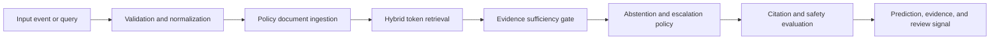

# Architecture

## Problem

Clinical assistants need retrieval, source attribution, and explicit abstention before answers reach care teams.

## System Flow

## Components

- **Policy document ingestion**
- **Hybrid token retrieval**
- **Evidence sufficiency gate**
- **Abstention and escalation policy**
- **Citation and safety evaluation**

## Model Architecture

The included baseline is a transparent token-prototype model. Training builds
per-label token weights and inverse-document-frequency retrieval weights from
the synthetic training split. The runtime returns a prediction, confidence,
review flag, and evidence documents. This baseline is intentionally small so
it can run in CI without paid compute.

For production, compare it with domain embeddings, gradient-boosted models, or
fine-tuned transformer models using the same held-out evaluation contract.

## Production Boundaries

- Validate and version all input schemas.
- Keep human review for low-confidence or high-impact decisions.
- Store prompts, traces, model versions, and dataset versions together.
- Do not treat synthetic evaluation performance as production evidence.
- Add authentication, authorization, encryption, and retention controls.

## Known Risks

Synthetic educational data only. The baseline must not provide diagnosis, treatment, or emergency medical advice.
